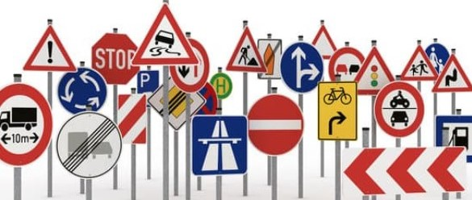
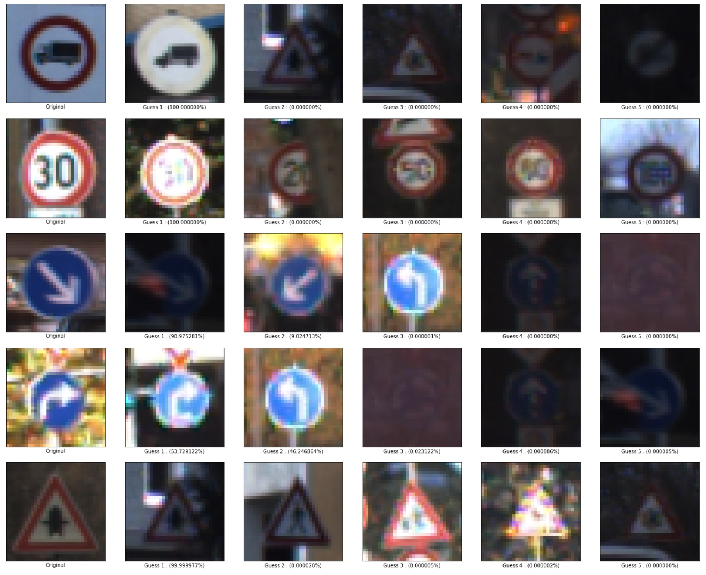

## Project: Build a Traffic Sign Recognition Program
[](http://www.udacity.com/drive)

Overview
---
In this project, I used CNNs Network to classify traffic signs. 


### Table of Contents

1. [File Descriptions](#files)
2. [Run](#results)
3. [Licensing, Authors, and Acknowledgements](#licensing)

## File Descriptions <a name="files"></a>

```
- Traffic_sign_Classifier.ipynb   # Research file 
- Traffic_sign_Classifier.html    # Research file html format
- save_model      # Save Model parameters
- report.md  # the project report
- README.md   # the project readme
- requirements.txt # the environment dependences
```

## Run <a name="results"></a>

```
pip install -r requirments.txt
```
```
jupyter notebook
```

## Licensing, Authors, and Acknowledgements <a name="licensing"></a>

### Built With
* [Tensorflow v2.4.1](https://www.tensorflow.org/) - TensorFlow is an end-to-end open source platform for machine learning.

* [Dataset](https://www.kaggle.com/meowmeowmeowmeowmeow/gtsrb-german-traffic-sign) - German traffic signs

### Results
The highest accuracy is 97.64%.

```
    # Evaluate the model on the validation set
    results = mobilenet.evaluate(validation_batches)

    Evaluate on validation data
    69/69 [==============================] - 42s 616ms/step - loss: 0.1864 - accuracy: 0.9764
    validation loss, validation acc: [0.18635909259319305, 0.9764172434806824]
```
**Top_k 5:**



### Versioning

* We use [SemVer](http://semver.org/) for versioning. For the versions available, see the [tags on this repository](https://github.com/your/project/tags).

### Authors

* **Tom Ge** - *Self-Driving Car Engineer* - [github profile](https://github.com/tomgtqq)

### License

* This project is licensed under the MIT License
